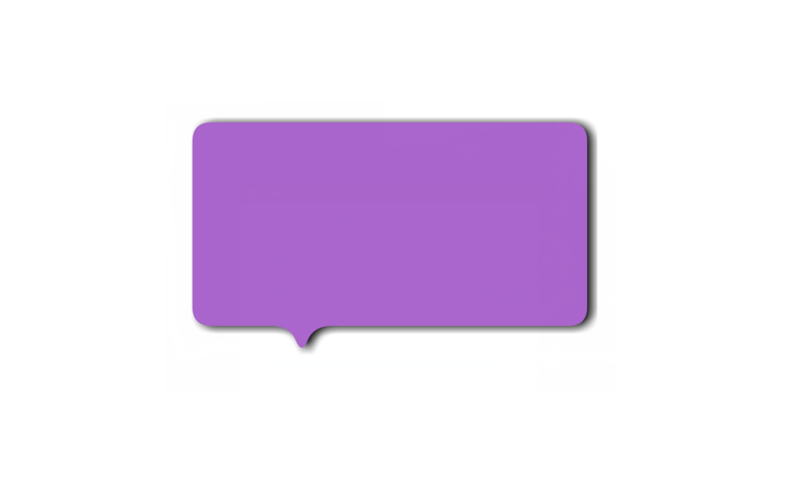
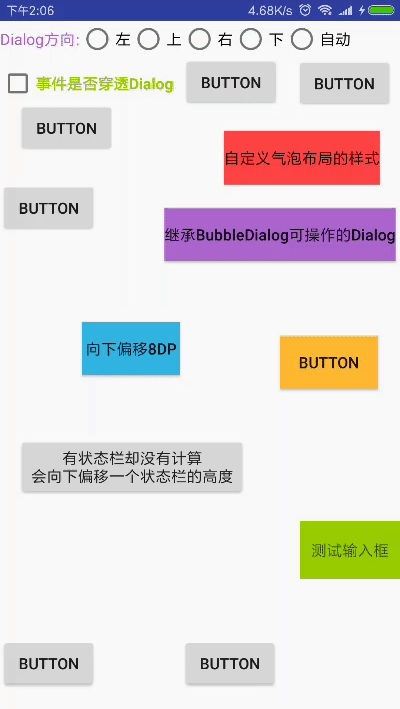
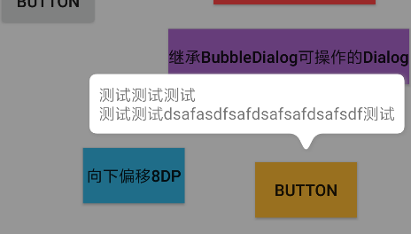
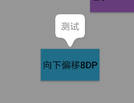
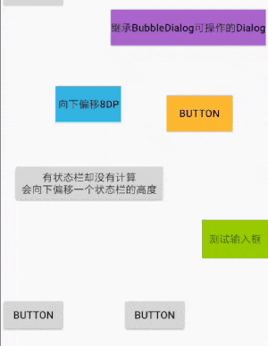
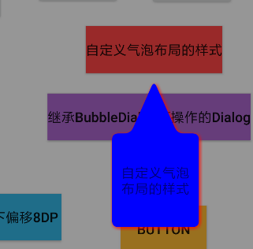
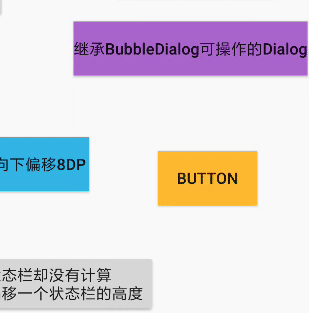

# HappyBubble
[](https://github.com/xujiaji/HappyBubble/releases) [](https://bintray.com/xujiaji/maven/happy-bubble/1.1.1)



气泡布局的形状可以改变，如四角弧度、气泡颜色、箭头大小和阴影。

气泡Dialog可以根据被点击的view的位置来确定自己展示的位置。

[English Doc](README.md)

 [旧文档（Old README）](README-old.md)
 
## 更新
- 1.1.1:修复大小变化后，没有对应变化位置的问题；修复接触顶部偏位问题；

- 1.1.0:<br>①Dialog交互事件传递到Activity达到不在不关闭Dialog的情况下做其他Activity的操作。<br>②添加自动根据被点击View距离屏幕边缘的距离确定Dialog的位置。<br>③新增“autoPosition”和“setThroughEvent”方法，请参考“BubbleDialog方法参考表”


- 1.0.3:继续优化了点击在气泡之外才会被dismiss；修复了Dialog周围会有部分点击无法dismiss；

- 1.0.2:修复点击dialog边缘无法取消


## 如何开始?
在你模块中的build.gradle添加上HappyBubble依赖
```
compile 'com.github.xujiaji:happy-bubble:1.1.1'
```

## 如何使用 HappyBubble-BubbleDialog?
> 方法参考表

|方法名|参数|描述|
|:-|:-:|:-|
|addContentView|View|添加填充在气泡中的视图|
|setClickedView|View|被点击的View（触发Dialog出现的View）|
|setPosition|enum BubbleDialog.Position:LEFT, TOP, RIGHT, BOTTOM|BubbleDialog相对于被点击的view的位置|
|calBar|boolean|是否计算状态栏的高度（如果布局没有全屏，则需要计算）|
|setOffsetX|int|如果您对dialog所展示的x轴位置不满，需要调整x轴方向偏移|
|setOffsetY|int|如果您对dialog所展示的y轴位置不满，需要调整y轴方向偏移|
|setBubbleLayout|BubbleLayout|自定义dialog的气泡布局|
|setTransParentBackground|-|背景透明|
|softShowUp|-|当气泡dialog中有EditText时，软键盘弹出会遮挡EditText时，dialog随软键盘上移。|
|show|-|显示|
|autoPosition|boolean|是否开启自动确定位置功能，开启后，“setPosition”功能失效|
|setThroughEvent|boolean, boolean|第一个参数isThroughEvent设置是否穿透Dialog手势交互。<br>第二个参数cancelable 点击空白是否能取消Dialog，只有当"isThroughEvent = false"时才有效|

### 最简单的实现
|||
|-|-|
|||

> 需要提供：Context、填充的View、被点击的View。</br>
> 如果最外层布局没有全屏时，您需要计算状态栏的高度，否则会多向下偏移一个状态栏的高度。

``` java
new BubbleDialog(this)
        .addContentView(LayoutInflater.from(this).inflate(R.layout.dialog_view3, null))
        .setClickedView(mButton)
        .calBar(true)
        .show();
```
### 向下偏移8dp

``` java
new BubbleDialog(this)
        .addContentView(LayoutInflater.from(this).inflate(R.layout.dialog_view3, null))
        .setClickedView(mButton4)
        .setPosition(mPosition)
        .setOffsetY(8)
        .calBar(true)
        .show();
```
### 当想要输入框随软键盘上移时

``` java
new BubbleDialog(this)
        .addContentView(LayoutInflater.from(this).inflate(R.layout.dialog_view, null))
        .setClickedView(mButton12)
        .setPosition(mPosition)
        .calBar(true)
        .softShowUp()
        .show();
```
### 自定义 BubbleLayout.


``` java
BubbleLayout bl = new BubbleLayout(this);
bl.setBubbleColor(Color.BLUE);
bl.setShadowColor(Color.RED);
bl.setLookLength(Util.dpToPx(this, 54));
bl.setLookWidth(Util.dpToPx(this, 48));
new BubbleDialog(this)
        .addContentView(LayoutInflater.from(this).inflate(R.layout.dialog_view5, null))
        .setClickedView(mButton8)
        .setPosition(mPosition)
        .calBar(true)
        .setBubbleLayout(bl)
        .show();
```
### 自定义 BubbleDialog，可交互的 BubbleDialog.

> 1、布局

``` xml
<?xml version="1.0" encoding="utf-8"?>
<LinearLayout xmlns:android="http://schemas.android.com/apk/res/android"
    android:layout_width="160dp"
    android:layout_height="match_parent"
    android:orientation="vertical">

    <Button
        android:id="@+id/button13"
        android:layout_width="match_parent"
        android:layout_height="wrap_content"
        android:text="Button1" />

    <Button
        android:id="@+id/button14"
        android:layout_width="match_parent"
        android:layout_height="wrap_content"
        android:text="Button2" />

    <Button
        android:id="@+id/button15"
        android:layout_width="match_parent"
        android:layout_height="wrap_content"
        android:text="Button3" />

</LinearLayout>
```
> 2、自定义 BubbleDialog

``` java

/**
 * 自定义可操作性dialog
 * Created by JiajiXu on 17-12-11.
 */

public class CustomOperateDialog extends BubbleDialog implements View.OnClickListener
{
    private ViewHolder mViewHolder;
    private OnClickCustomButtonListener mListener;

    public CustomOperateDialog(Context context)
    {
        super(context);
        calBar(true);
        setTransParentBackground();
        setPosition(Position.TOP);
        View rootView = LayoutInflater.from(context).inflate(R.layout.dialog_view4, null);
        mViewHolder = new ViewHolder(rootView);
        addContentView(rootView);
        mViewHolder.btn13.setOnClickListener(this);
        mViewHolder.btn14.setOnClickListener(this);
        mViewHolder.btn15.setOnClickListener(this);
    }

    @Override
    public void onClick(View v)
    {
        if (mListener != null)
        {
            mListener.onClick(((Button)v).getText().toString());
        }
    }

    private static class ViewHolder
    {
        Button btn13, btn14, btn15;
        public ViewHolder(View rootView)
        {
            btn13 = rootView.findViewById(R.id.button13);
            btn14 = rootView.findViewById(R.id.button14);
            btn15 = rootView.findViewById(R.id.button15);
        }
    }

    public void setClickListener(OnClickCustomButtonListener l)
    {
        this.mListener = l;
    }

    public interface OnClickCustomButtonListener
    {
        void onClick(String str);
    }
}

```

> 3、显示

``` java
CustomOperateDialog codDialog = new CustomOperateDialog(this)
        .setPosition(mPosition)
        .setClickedView(mButton10);
codDialog.setClickListener(new CustomOperateDialog.OnClickCustomButtonListener()
{
    @Override
    public void onClick(String str)
    {
        mButton10.setText("点击了：" + str);
    }
});
codDialog.show();
```
### 查看关于BappyDialog的使用代码
[TestDialogActivity 代码](app/src/main/java/com/xujiaji/happybubbletest/TestDialogActivity.java)

---


## 如何使用 HappyBubble-BubbleLayout?
### 在XML代码中设置属性值
> 属性参照表

|属性|值|描述|
|:-|:-:|:-|
|lookAt|left, top, right, bottom|箭头指向|
|lookLength|dimension|箭头的长度|
|lookPosition|dimension|箭头相对于x或y轴的位置|
|lookWidth|dimension|箭头的宽度|
|bubbleColor|color|气泡的颜色|
|bubbleRadius|dimension|气泡四角的圆弧|
|bubblePadding|dimension|气泡边缘到内容的距离|
|shadowRadius|dimension|阴影的扩散大小|
|shadowX|dimension|阴影在x轴方向的偏移|
|shadowY|dimension|阴影在y轴方向的偏移|
|shadowColor|color|阴影的颜色|

> xml 例子

``` xml
    <com.xujiaji.happybubble.BubbleLayout
        xmlns:app="http://schemas.android.com/apk/res-auto"
        android:id="@+id/bubbleLayout"
        android:layout_width="match_parent"
        android:layout_height="200dp"
        android:layout_margin="16dp"
        app:lookAt="left"
        app:lookLength="16dp"
        app:lookPosition="20dp"
        app:lookWidth="16dp" />
```

### 在java代码中定义属性值。
> BubbleLayout 通过“set属性名”方法和invalidate方法来更新BubbleLayout。

``` java
mBubbleLayout.setLook(BubbleLayout.Look.LEFT);
```
> 查看更多

[MainActivity 代码](app/src/main/java/com/xujiaji/happybubbletest/MainActivity.java)


### demo 下载
[](https://github.com/xujiaji/HappyBubble/releases)

---

# License
```
   Copyright 2016 XuJiaji

   Licensed under the Apache License, Version 2.0 (the "License");
   you may not use this file except in compliance with the License.
   You may obtain a copy of the License at

       http://www.apache.org/licenses/LICENSE-2.0

   Unless required by applicable law or agreed to in writing, software
   distributed under the License is distributed on an "AS IS" BASIS,
   WITHOUT WARRANTIES OR CONDITIONS OF ANY KIND, either express or implied.
   See the License for the specific language governing permissions and
   limitations under the License.
```
