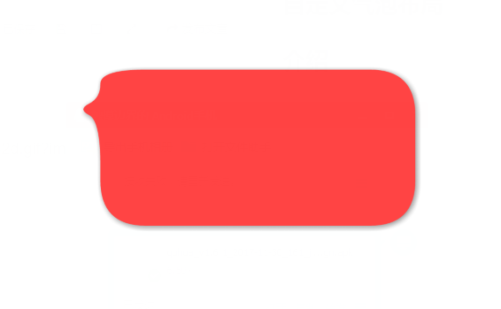
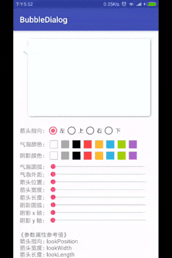
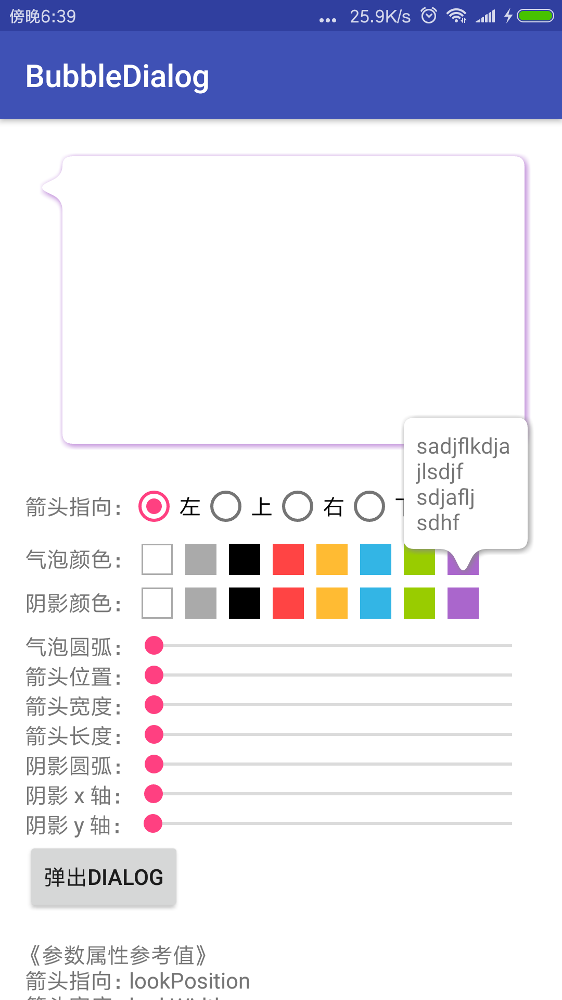
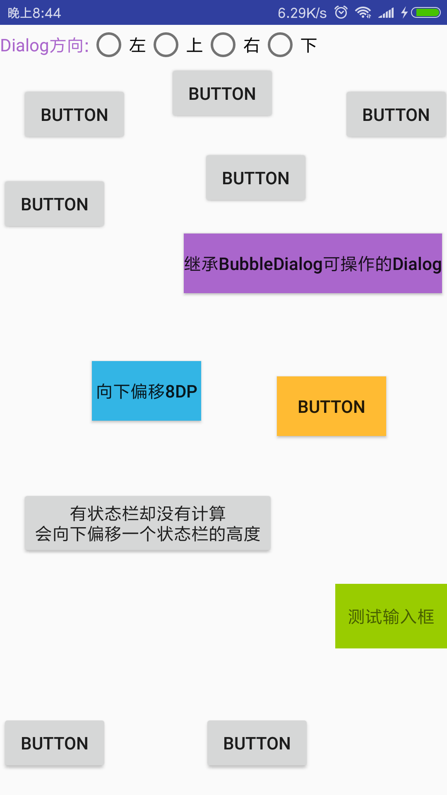

# HappyBubble


# 介绍
做项目经常会用到这样的布局，每每都是用的切的图片来实现的。由于这样不怎么方便，所以诞生了何不自己画一个的思路。目前这个布局可以通过设置一些属性来达到想要的一些效果，如下GIF图片。



# 进度
2017-12-12：添加自定义气泡的方法，并添加其测试代码

2017-12-11：测试dialog的展示交互

2017-12-10: 完成所有功能，接下来测试一段时间

2017-12-8：实现dialog按钮底部弹出，修复一些bug

2017-12-6：设置dialog有editText时可以上移。dialog关闭时，软键盘可自动关闭

2017-12-4：实现dialog按钮处顶部弹出

|案例一|案例二|测试Dialog|
|-|-|-|
| |||

# demo下载
https://link.jianshu.com/?t=https://github.com/xujiaji/HappyBubble/releases/download/demo1.0/BubbleLayoutDemo.apk

# 代码
- 思路很简单，用的是path直接绘制的路径。
- 通过Paint的setPathEffect方法设置圆弧
- 通过Paint的setShadowLayer方法设置阴影
- 话不多说了，接下来直接上代码。
> 实现部分
``` java
package com.xujiaji.bubblelayout;

import android.content.Context;
import android.content.res.TypedArray;
import android.graphics.Canvas;
import android.graphics.Color;
import android.graphics.CornerPathEffect;
import android.graphics.Paint;
import android.graphics.Path;
import android.os.Bundle;
import android.os.Parcelable;
import android.support.annotation.NonNull;
import android.support.annotation.Nullable;
import android.util.AttributeSet;
import android.widget.FrameLayout;
/**
 * 气泡布局
 * Created by JiajiXu on 17-12-1.
 */

public class BubbleLayout extends FrameLayout {
    private Paint mPaint;
    private Path mPath;
    private Look mLook;
    private int mWidth, mHeight;
    private int mLeft, mTop, mRight, mBottom;
    private int mLookPosition, mLookWidth, mLookLength;
    private int mShadowColor, mShadowRadius, mShadowX, mShadowY;
    private int mBubbleRadius, mBubbleMargin, mBubbleColor;

    /**
     * 箭头指向
     */
    public enum Look
    {
        /**
         * 坐上右下
         */
        LEFT(1), TOP(2), RIGHT(3), BOTTOM(4);
        int value;
        Look(int v)
        {
            value = v;
        }

        public static Look getType(int value)
        {
            Look type = Look.BOTTOM;
            switch (value)
            {
                case 1:
                    type = Look.LEFT;
                    break;
                case 2:
                    type = Look.TOP;
                    break;
                case 3:
                    type = Look.RIGHT;
                    break;
                case 4:
                    type = Look.BOTTOM;
                    break;
            }

            return type;
        }
    }


    public BubbleLayout(@NonNull Context context) {
        this(context, null);
    }

    public BubbleLayout(@NonNull Context context, @Nullable AttributeSet attrs) {
        this(context, attrs, 0);
    }

    public BubbleLayout(@NonNull Context context, @Nullable AttributeSet attrs, int defStyleAttr) {
        super(context, attrs, defStyleAttr);
        setLayerType(LAYER_TYPE_SOFTWARE, null);
        setWillNotDraw(false);
        initAttr(context.obtainStyledAttributes(attrs, R.styleable.BubbleLayout, defStyleAttr, 0));
        mPaint = new Paint(Paint.ANTI_ALIAS_FLAG | Paint.DITHER_FLAG);
        mPaint.setStyle(Paint.Style.FILL);
        mPath = new Path();

    }

    /**
     * 初始化参数
     */
    private void initAttr(TypedArray a) {
        mLook = Look.getType(a.getInt(R.styleable.BubbleLayout_lookAt, Look.BOTTOM.value));
        mLookPosition = a.getDimensionPixelOffset(R.styleable.BubbleLayout_lookPosition, 0);
        mLookWidth    = a.getDimensionPixelOffset(R.styleable.BubbleLayout_lookWidth, 50);
        mLookLength   = a.getDimensionPixelOffset(R.styleable.BubbleLayout_lookLength, 50);
        mShadowRadius = a.getDimensionPixelOffset(R.styleable.BubbleLayout_shadowRadius, 10);
        mShadowX      = a.getDimensionPixelOffset(R.styleable.BubbleLayout_shadowX, 3);
        mShadowY      = a.getDimensionPixelOffset(R.styleable.BubbleLayout_shadowY, 3);
        mBubbleRadius = a.getDimensionPixelOffset(R.styleable.BubbleLayout_bubbleRadius, 20);
        mBubbleMargin = a.getDimensionPixelOffset(R.styleable.BubbleLayout_bubbleMargin, 10);
        mShadowColor  = a.getColor(R.styleable.BubbleLayout_shadowColor, Color.GRAY);
        mBubbleColor  = a.getColor(R.styleable.BubbleLayout_bubbleColor, Color.WHITE);
        a.recycle();
    }


    @Override
    protected void onSizeChanged(int w, int h, int oldw, int oldh) {
        super.onSizeChanged(w, h, oldw, oldh);
        mWidth = w;
        mHeight = h;
        initData();
    }

    @Override
    public void invalidate() {
        initData();
        super.invalidate();
    }

    @Override
    public void postInvalidate() {
        initData();
        super.postInvalidate();
    }

    /**
     * 初始化数据
     */
    private void initData() {
        mPaint.setPathEffect(new CornerPathEffect(mBubbleRadius));
        mPaint.setShadowLayer(mShadowRadius, mShadowX, mShadowY, mShadowColor);

        //最小外边距
        final int minMargin = (mShadowX > mShadowY ? mShadowX : mShadowY) * 4;
        //限制外边距的最小值
        mBubbleMargin = mBubbleMargin < minMargin ? minMargin : mBubbleMargin;
        final int minLength = mWidth > mHeight ? mHeight : mWidth;
        mBubbleMargin = (mBubbleMargin * 2 > (minLength - mLookWidth - mLookPosition) ? (minLength - mLookWidth - mLookPosition) / 2 : mBubbleMargin);

        mLeft = mBubbleMargin + getPaddingLeft() + (mLook == Look.LEFT ? mLookLength : 0);
        mTop = mBubbleMargin + getPaddingTop() + (mLook == Look.TOP ? mLookLength : 0);
        mRight = mWidth - mBubbleMargin - getPaddingRight() - (mLook == Look.RIGHT ? mLookLength : 0);
        mBottom = mHeight - mBubbleMargin - getPaddingBottom() - (mLook == Look.BOTTOM ? mLookLength : 0);
        mPaint.setColor(mBubbleColor);

        mPath.reset();
        int topOffset = (topOffset = (mTop + mLookPosition)) > mBottom ? mBottom - mLookWidth : topOffset;
        int leftOffset = (leftOffset = mLeft + mLookPosition) > mRight ? mRight - mLookWidth : leftOffset;
        switch (mLook)
        {
            case LEFT:
                mPath.moveTo(mLeft, topOffset);
                mPath.rLineTo(-mLookLength, mLookWidth / 2);
                mPath.rLineTo(mLookLength, mLookWidth / 2);
                mPath.lineTo(mLeft, mBottom);
                mPath.lineTo(mRight, mBottom);
                mPath.lineTo(mRight, mTop);
                mPath.lineTo(mLeft, mTop);
                break;
            case TOP:
                mPath.moveTo(leftOffset, mTop);
                mPath.rLineTo(mLookWidth / 2, -mLookLength);
                mPath.rLineTo(mLookWidth / 2, mLookLength);
                mPath.lineTo(mRight, mTop);
                mPath.lineTo(mRight, mBottom);
                mPath.lineTo(mLeft, mBottom);
                mPath.lineTo(mLeft, mTop);
                break;
            case RIGHT:
                mPath.moveTo(mRight, topOffset);
                mPath.rLineTo(mLookLength, mLookWidth / 2);
                mPath.rLineTo(-mLookLength, mLookWidth / 2);
                mPath.lineTo(mRight, mBottom);
                mPath.lineTo(mLeft, mBottom);
                mPath.lineTo(mLeft, mTop);
                mPath.lineTo(mRight, mTop);
                break;
            case BOTTOM:
                mPath.moveTo(leftOffset, mBottom);
                mPath.rLineTo(mLookWidth / 2, mLookLength);
                mPath.rLineTo(mLookWidth / 2, -mLookLength);
                mPath.lineTo(mRight, mBottom);
                mPath.lineTo(mRight, mTop);
                mPath.lineTo(mLeft, mTop);
                mPath.lineTo(mLeft, mBottom);
                break;
        }

        mPath.close();
    }

    @Override
    protected void onDraw(Canvas canvas) {
        super.onDraw(canvas);
        canvas.drawPath(mPath, mPaint);
    }

    public void setBubbleColor(int mBubbleColor) {
        this.mBubbleColor = mBubbleColor;
    }

    public void setLook(Look mLook) {
        this.mLook = mLook;
    }

    public void setLookPosition(int mLookPosition) {
        this.mLookPosition = mLookPosition;
    }

    public void setLookWidth(int mLookWidth) {
        this.mLookWidth = mLookWidth;
    }

    public void setLookLength(int mLookLength) {
        this.mLookLength = mLookLength;
    }

    public void setShadowColor(int mShadowColor) {
        this.mShadowColor = mShadowColor;
    }

    public void setShadowRadius(int mShadowRadius) {
        this.mShadowRadius = mShadowRadius;
    }

    public void setShadowX(int mShadowX) {
        this.mShadowX = mShadowX;
    }

    public void setShadowY(int mShadowY) {
        this.mShadowY = mShadowY;
    }

    public void setBubbleRadius(int mBubbleRadius) {
        this.mBubbleRadius = mBubbleRadius;
    }

    public void setBubbleMargin(int mBubbleMargin) {
        this.mBubbleMargin = mBubbleMargin;
    }

    public Parcelable onSaveInstanceState() {
        Bundle bundle = new Bundle();
        bundle.putParcelable("instanceState", super.onSaveInstanceState());
        bundle.putInt("mLookPosition", this.mLookPosition);
        bundle.putInt("mLookWidth"   , this.mLookWidth   );
        bundle.putInt("mLookLength"  , this.mLookLength  );
        bundle.putInt("mShadowColor" , this.mShadowColor );
        bundle.putInt("mShadowRadius", this.mShadowRadius);
        bundle.putInt("mShadowX"     , this.mShadowX     );
        bundle.putInt("mShadowY"     , this.mShadowY     );
        bundle.putInt("mBubbleRadius", this.mBubbleRadius);
        bundle.putInt("mBubbleMargin", this.mBubbleMargin);
        bundle.putInt("mWidth"       , this.mWidth       );
        bundle.putInt("mHeight"      , this.mHeight      );
        bundle.putInt("mLeft"        , this.mLeft        );
        bundle.putInt("mTop"         , this.mTop         );
        bundle.putInt("mRight"       , this.mRight       );
        bundle.putInt("mBottom"      , this.mBottom      );
        return bundle;
    }
//    private int mWidth, mHeight;
//    private int mLeft, mTop, mRight, mBottom;
    public void onRestoreInstanceState(Parcelable state) {
        if (state instanceof Bundle) {
            Bundle bundle = (Bundle) state;
            this.mLookPosition = bundle.getInt("mLookPosition");
            this.mLookWidth    = bundle.getInt("mLookWidth"   );
            this.mLookLength   = bundle.getInt("mLookLength"  );
            this.mShadowColor  = bundle.getInt("mShadowColor" );
            this.mShadowRadius = bundle.getInt("mShadowRadius");
            this.mShadowX      = bundle.getInt("mShadowX"     );
            this.mShadowY      = bundle.getInt("mShadowY"     );
            this.mBubbleRadius = bundle.getInt("mBubbleRadius");
            this.mBubbleMargin = bundle.getInt("mBubbleMargin");
            this.mWidth        = bundle.getInt("mWidth"       );
            this.mHeight       = bundle.getInt("mHeight"      );
            this.mLeft         = bundle.getInt("mLeft"        );
            this.mTop          = bundle.getInt("mTop"         );
            this.mRight        = bundle.getInt("mRight"       );
            this.mBottom       = bundle.getInt("mBottom"      );
            super.onRestoreInstanceState(bundle.getParcelable("instanceState"));
            return;
        }
        super.onRestoreInstanceState(state);
    }
}

```
> attrs.xml参数配置
```xml
<?xml version="1.0" encoding="utf-8"?>
<resources>
    <declare-styleable name="BubbleLayout">
        <attr name="lookAt">
            <enum name="left"   value="1"/>
            <enum name="top"    value="2"/>
            <enum name="right"  value="3"/>
            <enum name="bottom" value="4"/>
        </attr>

        <attr name="lookPosition" format="dimension"/>
        <attr name="lookWidth"    format="dimension"/>
        <attr name="lookLength"   format="dimension"/>
        <attr name="bubbleColor"  format="color"/>
        <attr name="bubbleRadius" format="dimension"/>
        <attr name="bubbleMargin" format="dimension"/>
        <attr name="shadowRadius" format="dimension"/>
        <attr name="shadowX"      format="dimension"/>
        <attr name="shadowY"      format="dimension"/>
        <attr name="shadowColor"  format="color"/>
    </declare-styleable>
</resources>
```

> activity_mian使用部分
```xml
    <com.xujiaji.bubble.BubbleLayout
        android:id="@+id/bubbleLayout"
        android:layout_width="match_parent"
        android:layout_height="200dp"
        android:layout_margin="16dp"
        app:lookAt="left"
        app:lookLength="16dp"
        app:lookPosition="20dp"
        app:lookWidth="16dp" />
```
---

# END
现在只是实现的布局部分，接下来需要的是一个Dialog弹窗.后面将会将其融入Dialog，实现箭头能直接指向点击控件的中心。目前代码因该不算太完善，不足和考虑不周的地方也希望大家多多指点！
